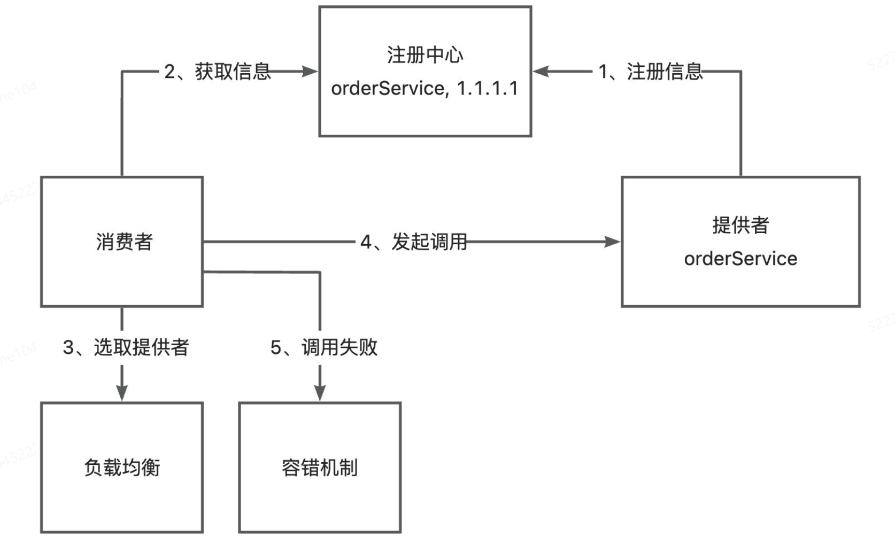

# rpc-java

- Reference

  [yu-rpc (github)](https://github.com/liyupi/yu-rpc), [yupi note](https://wx.zsxq.com/dweb2/index/columns/51122858222824),  

  [Vert.x](https://vertx.io), 
  
  


- Introduction

  轮子类项目，开发RPC框架 

  先核心流程，再做业务扩展

  CRUD，架构设计的思路和技巧


- 几种模式

  RPC

  SDK


## 背景介绍

### PRC概念

- 是什么

  RPC: Remote Procedure Call 远程过程调用

  计算机通信协议

  允许程序在不同的计算机之间进行通信和交互，就像本地调用一样

- 为什么

  `服务消费者` -> `服务提供者`

  不需要了解数据的传输处理过程、底层网络通信的细节 (RPC框架封装)

  开发者可以轻松调用远程服务，快速开发分布式系统


- 例子：A提供者(点餐服务) B消费者

  ```
  interface OrderService {
    // 点餐 返回 orderId
    long order(parameter1, parameter2, parameter3)
  }
  ```

- 没有RPC的调用

  AB独立系统 不能SDK作为依赖包引入

  A 提供web服务 编写点餐接口暴露服务 http://time1043.doc/order
  
  B 服务消费者 构造请求 HttpClient (调用更多第三方服务 麻烦!)

  ```
  url = "http://time1043.doc/order"
  req = new Req(parameter1, parameter2, parameter3)
  resp = httpClient.post(url).body(req).execute()
  orderId = resp.data.orderId
  ```
  
- 有RPC (看起来就像本地调用)

  ```
  orderId = OrderService.order(parameter1, parameter2, parameter3)
  ```

  


### RPC框架实现思路

- 基本设计 (跑通基本调用过程)

  `消费者` -> HttpClient 

  `提供者` <- web服务

- Q：多个服务和方法？单独写接口单独调用 X 

  `请求处理器` 根据客户端的请求参数 调用不同的服务和方法

  `本地服务注册器` 记录服务和对应现实类的映射

  `序列化反序列化` Java对象无法直接在网络中传输

  `代理对象` 简化消费者本地调用

  


- 扩展设计

- Q：服务注册发现 (消费者如何知道提供者的调用地址)

  `注册中心` 保存服务提供者的地址 消费者调用服务时从注册中心获取 (`Redis`, `Zookeeper`)

- Q：负载均衡 (多个提供者，消费者该调用谁)

  `负载均衡` 不同算法 (轮询 随机 根据性能动态调用)

- Q：容错机制 (若服务调用失败怎么办)

  `容错机制` 分布式系统的高可用 (失败重试 降级调用其他接口)

  

- 更多问题等待优化

  服务提供者下线了怎么办？失效节点剔除机制

  消费者每次都从注册中心拉取信息，性能差吗？使用缓存优化性能

  如何优化RPC框架的传输通讯性能？选择合适的网络框架、自定义协议头、节约传输体积等等

  如果让整个框架更利于扩展？Java的SPI机制、配置化等等

  ...


## 开发简易RPC框架

- 项目初始化

  ```bash
  cd /d/code2/java-code/rpc-oswin/
  mkdir rpc-demo  # IDEA Maven Module 
  # example-common: 示例代码的公共依赖 (包括接口 Model)
  # example-consumer: 示例服务消费者代码
  # example-provider: 示例服务提供者代码
  # rpc-easy: 简易RPC框架
  
  example.common.model.User (class)
  example.common.service.UserService (interface)
  
  
  # rpc-easy
  rpceasy.server.HttpServer (interface)
  rpceasy.server.VertxHttpServer (class)
  
  rpceasy.registry.LocalRegistry (class)
  
  rpceasy.serializer.Serializer (interface)
  rpceasy.serializer.JdkSerializer (class)
  
  rpceasy.model.RpcRequest (class)
  rpceasy.model.RpcResponse (class)
  rpceasy.server.HttpServerHandler (class)
  
  
  ```
  
- 项目结构

- `example-common`：需要同时被消费者和提供者引入，主要编写服务相关的接口和数据模型

  用户实体类 User (对象需要序列化接口 为后续网络传输序列化提供支持)

  用户服务接口 UserService

- `example-provider`：实现接口

  导入依赖 

  服务实现类 实现公共模块中定义的用户服务接口

  服务提供者启动类 EasyProviderExample

- `example-consumer`：调用服务

  导入依赖
  
  消费者启动类 EasyConsumerExample
  
- `rpc-easy`：

  VertxHttpServer (能够监听指定端口 并处理请求)


### example-common

- User

  ```java
  package com.time1043.example.common.model;
  
  import java.io.Serializable;
  
  /**
   * 用户
   */
  public class User implements Serializable {
      private String name;
  
      public String getName() {
          return name;
      }
  
      public void setName(String name) {
          this.name = name;
      }
  }
  
  ```

- UserService

  ```java
  package com.time1043.example.common.service;
  
  import com.time1043.example.common.model.User;
  
  /**
   * 用户服务
   */
  public interface UserService {
      /**
       * 获取用户
       * @param user
       * @return
       */
      User getUser(User user);
  }
  
  ```

  


### example-provider

- 导入依赖

  ```xml
      <dependencies>
          <dependency>
              <groupId>com.time1043</groupId>
              <artifactId>rpc-easy</artifactId>
              <version>1.0-SNAPSHOT</version>
          </dependency>
          <dependency>
              <groupId>com.time1043</groupId>
              <artifactId>example-common</artifactId>
              <version>1.0-SNAPSHOT</version>
          </dependency>
  
          <!-- https://doc.hutool.cn/ -->
          <dependency>
              <groupId>cn.hutool</groupId>
              <artifactId>hutool-all</artifactId>
              <version>5.8.16</version>
          </dependency>
  
          <!-- https://projectlombok.org/ -->
          <dependency>
              <groupId>org.projectlombok</groupId>
              <artifactId>lombok</artifactId>
              <version>1.18.30</version>
              <scope>provided</scope>
          </dependency>
      </dependencies>
  ```

- 服务实现类 UserServiceImpl

  ```java
  package com.time1043.example.provider;
  
  import com.time1043.example.common.model.User;
  import com.time1043.example.common.service.UserService;
  
  public class UserServiceImpl implements UserService {
      @Override
      public User getUser(User user) {
          System.out.println("username: " + user.getName());
          return user;
      }
  }
  
  ```

- 启动类 EasyProviderExample

  ```java
  package com.time1043.example.provider;
  
  /**
   * 简单服务提供者示例
   */
  public class EasyProviderExample {
      public static void main(String[] args) {
          // TODO 提供服务
      }
  }
  
  ```

  


### example-consumer

- 导入依赖

  ```xml
      <dependencies>
          <dependency>
              <groupId>com.time1043</groupId>
              <artifactId>rpc-easy</artifactId>
              <version>1.0-SNAPSHOT</version>
          </dependency>
          <dependency>
              <groupId>com.time1043</groupId>
              <artifactId>example-common</artifactId>
              <version>1.0-SNAPSHOT</version>
          </dependency>
  
          <!-- https://doc.hutool.cn/ -->
          <dependency>
              <groupId>cn.hutool</groupId>
              <artifactId>hutool-all</artifactId>
              <version>5.8.16</version>
          </dependency>
  
          <!-- https://projectlombok.org/ -->
          <dependency>
              <groupId>org.projectlombok</groupId>
              <artifactId>lombok</artifactId>
              <version>1.18.30</version>
              <scope>provided</scope>
          </dependency>
      </dependencies>
  ```

- 启动类

  现在无法获取UserService实例 

  后续会通过RPC框架，快速得到一个支持远程调用服务提供者的代理对象，然后就像调用本地一样调用UserService的方法

  ```java
  package com.time1043.example.consumer;
  
  import com.time1043.example.common.model.User;
  import com.time1043.example.common.service.UserService;
  
  public class EasyConsumerExample {
      public static void main(String[] args) {
          // TODO 需要获取 UserService 的实现类对象
          UserService userService = null;
          User user = new User();
          user.setName("oswin");
  
          // 调用
          User newUser = userService.getUser(user);
          if (newUser!= null){
              System.out.println(newUser.getName());
          } else {
              System.out.println("user == null");
          }
      }
  }
  
  ```

  


### rpc-easy

- web服务器

  让服务提供者 提供 可远程访问的服务

  需要web服务器，能够接受处理请求、并返回响应

- 选择

  SpringBoot内嵌的Tomcat

  NIO框架的Netty和[Vert.x](https://vertx.io)

  

---

- 导入依赖

  ```xml
      <dependencies>
          <!-- https://mvnrepository.com/artifact/io.vertx/vertx-core -->
          <dependency>
              <groupId>io.vertx</groupId>
              <artifactId>vertx-core</artifactId>
              <version>4.5.1</version>
          </dependency>
  
          <!-- https://doc.hutool.cn/ -->
          <dependency>
              <groupId>cn.hutool</groupId>
              <artifactId>hutool-all</artifactId>
              <version>5.8.16</version>
          </dependency>
  
          <!-- https://projectlombok.org/ -->
          <dependency>
              <groupId>org.projectlombok</groupId>
              <artifactId>lombok</artifactId>
              <version>1.18.30</version>
              <scope>provided</scope>
          </dependency>
      </dependencies>
  ```

- web服务器接口HttpServer

  定义统一的启动服务器方法 便于后续扩展 (如实现多种不同的web服务器)

  ```java
  package com.time1043.rpceasy.server;
  
  /**
   * HTTP 服务器接口
   */
  public interface HttpServer {
      /**
       * 启动服务器
       *
       * @param port
       */
      void doStart(int port);
  }
  
  ```

  基于Vert.x实现的web服务器 VertxHttpServer (能够监听指定端口 并处理请求)

  ```java
  package com.time1043.rpceasy.server;
  
  import io.vertx.core.Vertx;
  
  public class VertxHttpServer implements HttpServer {
      @Override
      public void doStart(int port) {
          // 创建 Vert.x 实例
          Vertx vertx = Vertx.vertx();
          // 创建 HTTP 服务器
          io.vertx.core.http.HttpServer server = vertx.createHttpServer();
  
          // 监听端口并处理请求
          server.requestHandler(request -> {
              // 处理请求
              System.out.println("Received request: " + request.method() + " " + request.uri());
  
              // 发送响应
              request.response()
                     .putHeader("content-type", "text/plain")
                     .end("Hello from Vert.x HTTP Server!");
          });
  
          // 启动 HTTP 服务器 并监听指定端口
          server.listen(port, result -> {
              if (result.succeeded()) {
                  System.out.println("Server is now listening on port " + port);
              } else {
                  System.out.println("Failed to start server: " + result.cause());
              }
          });
      }
  }
  
  ```

  

---

- 验证web服务器 能够启动成功 并接受请求 EasyProviderExample  http://localhost:8080/

  ```java
  package com.time1043.example.provider;
  
  import com.time1043.rpceasy.server.HttpServer;
  import com.time1043.rpceasy.server.VertxHttpServer;
  
  /**
   * 简单服务提供者示例
   */
  public class EasyProviderExample {
      public static void main(String[] args) {
          // 启动 web 服务
          HttpServer httpServer = new VertxHttpServer();
          httpServer.doStart(8080);
      }
  }
  
  ```

  


### 本地服务注册器

- 区别

  本地服务注册器：根据服务名获取到对应的实现类

  注册中心：侧重于管理注册的服务、提供服务信息给消费者

  


---

- 跑通流程阶段

  暂时不用第三方注册中心

  直接把服务注册到提供者本地

- 具体实现

  线程安全的 ConcurrentHashMap 存储服务注册信息 

  key 为服务名称、value 为服务的实现类

  根据要调用的服务名称 获取对应的实现类 然后通过反射进行方法调用

- rpc-demo\rpc-easy\src\main\java\com\time1043\rpceasy\registry\LocalRegistry.java

  ```java
  package com.time1043.rpceasy.registry;
  
  import java.util.Map;
  import java.util.concurrent.ConcurrentHashMap;
  
  /**
   * 本地注册中心
   */
  public class LocalRegistry {
      /**
       * 注册信息存储
       */
      private static final Map<String, Class<?>> map = new ConcurrentHashMap<>();
  
      /**
       * 注册服务
       *
       * @param serviceName
       * @param implClass
       */
      public static void register(String serviceName, Class<?> implClass) {
          map.put(serviceName, implClass);
      }
  
      /**
       * 获取服务
       *
       * @param serviceName
       * @return
       */
      public static Class<?> get(String serviceName) {
          return map.get(serviceName);
      }
  
      /**
       * 删除服务
       * 
       * @param serviceName
       */
      public static void remove(String serviceName) {
          map.remove(serviceName);
      }
  }
  
  ```

- rpc-demo\example-provider\src\main\java\com\time1043\example\provider\EasyProviderExample.java

  ```java
  package com.time1043.example.provider;
  
  import com.time1043.example.common.service.UserService;
  import com.time1043.rpceasy.registry.LocalRegistry;
  import com.time1043.rpceasy.server.HttpServer;
  import com.time1043.rpceasy.server.VertxHttpServer;
  
  /**
   * 简单服务提供者示例
   */
  public class EasyProviderExample {
      public static void main(String[] args) {
          // 注册服务
          LocalRegistry.register(UserService.class.getName(), UserServiceImpl.class);
  
          // 启动 web 服务
          HttpServer httpServer = new VertxHttpServer();
          httpServer.doStart(8080);
      }
  }
  
  ```

  


### 序列化器

- 序列化

  序列化：java对象 -> 可传输的字节数组

  反序列化：字节数组 -> java对象

- 实现方式

  java原生序列化、json、hessian、kryo、protobuf

- rpc-demo\rpc-easy\src\main\java\com\time1043\rpceasy\serializer\Serializer.java

  ```java
  package com.time1043.rpceasy.serializer;
  
  import java.io.IOException;
  
  public interface Serializer {
      /**
       * 序列化对象
       *
       * @param object
       * @return
       * @param <T>
       * @throws IOException
       */
      <T> byte[] serialize(T object) throws IOException;
  
      /**
       * 反序列化对象
       *
       * @param bytes
       * @param type
       * @return
       * @param <T>
       * @throws IOException
       */
      <T> T deserialize(byte[] bytes, Class<T> type) throws IOException;
  }
  
  ```

- rpc-demo\rpc-easy\src\main\java\com\time1043\rpceasy\serializer\JdkSerializerImpl.java

  ```java
  package com.time1043.rpceasy.serializer;
  
  import java.io.*;
  
  public class JdkSerializerImpl implements Serializer {
      /**
       * 序列化对象
       *
       * @param object
       * @return
       * @param <T>
       * @throws IOException
       */
      @Override
      public <T> byte[] serialize(T object) throws IOException {
          ByteArrayOutputStream outputStream = new ByteArrayOutputStream();
          ObjectOutputStream objectOutputStream = new ObjectOutputStream(outputStream);
  
          objectOutputStream.writeObject(object);
          objectOutputStream.close();
  
          return outputStream.toByteArray();
      }
  
      @Override
      public <T> T deserialize(byte[] bytes, Class<T> type) throws IOException {
          ByteArrayInputStream inputStream = new ByteArrayInputStream(bytes);
          ObjectInputStream objectInputStream = new ObjectInputStream(inputStream);
  
          try {
              return (T) objectInputStream.readObject();
          } catch (ClassNotFoundException e) {
              throw new RuntimeException(e);
          } finally {
              objectInputStream.close();
          }
      }
  }
  
  ```

  


### 请求处理器 (请求者处理调用)

- 概念

  处理接收到的请求 并根据请求参数找到对应的服务和方法

  通过反射实现调用 最后封装返回结果并响应请求

  


- 请求和响应的封装类

  rpc-demo\rpc-easy\src\main\java\com\time1043\rpceasy\model\RpcRequest.java

  封装调用所需的信息 (服务名称 方法名称 调用参数的类型列表 参数列表) - java反射

  ```java
  package com.time1043.rpceasy.model;
  
  import lombok.AllArgsConstructor;
  import lombok.Builder;
  import lombok.Data;
  import lombok.NoArgsConstructor;
  
  import java.io.Serializable;
  
  /**
   * RPC 请求
   */
  @Data
  @Builder
  @AllArgsConstructor
  @NoArgsConstructor
  public class RpcRequest implements Serializable {
      /**
       * 服务名称
       */
      private String serviceName;
  
      /**
       * 方法名称
       */
      private String methodName;
  
      /**
       * 参数类型列表
       */
      private Class<?>[] parameterTypes;
  
      /**
       * 参数列表
       */
      private Object[] args;
  }
  
  ```

- rpc-demo\rpc-easy\src\main\java\com\time1043\rpceasy\model\RpcResponse.java

  封装调用方法得到的返回值、以及调用的信息 (如异常情况)

  ```java
  package com.time1043.rpceasy.model;
  
  import lombok.AllArgsConstructor;
  import lombok.Builder;
  import lombok.Data;
  import lombok.NoArgsConstructor;
  
  import java.io.Serializable;
  
  /**
   * RPC 响应
   */
  @Data
  @Builder
  @AllArgsConstructor
  @NoArgsConstructor
  public class RpcResponse implements Serializable {
      /**
       * 响应数据
       */
      private Object data;
  
      /**
       * 响应数据类型 (预留)
       */
      private Class<?> dataType;
  
      /**
       * 响应信息
       */
      private String message;
  
      /**
       * 异常信息
       */
      private Exception exception;
  }
  
  ```

  


---

- 请求处理器

  rpc-demo\rpc-easy\src\main\java\com\time1043\rpceasy\server\HttpServerHandler.java

  反序列化请求对象，并从请求对象中获取参数

  根据服务名称从本地注册器中获取到对应的 服务实现类

  通过反射机制调用方法，得到返回结果

  对返回结果进行封装和序列化，并写入到响应中

  ```java
  package com.time1043.rpceasy.server;
  
  import com.time1043.rpceasy.model.RpcRequest;
  import com.time1043.rpceasy.model.RpcResponse;
  import com.time1043.rpceasy.registry.LocalRegistry;
  import com.time1043.rpceasy.serializer.JdkSerializer;
  import com.time1043.rpceasy.serializer.Serializer;
  import io.vertx.core.Handler;
  import io.vertx.core.buffer.Buffer;
  import io.vertx.core.http.HttpServerRequest;
  import io.vertx.core.http.HttpServerResponse;
  
  import java.lang.reflect.Method;
  
  /**
   * HTTP 请求处理
   */
  public class HttpServerHandler implements Handler<HttpServerRequest> {
      @Override
      public void handle(HttpServerRequest request) {
          // 指定序列化器
          final Serializer serializer = new JdkSerializer();
  
          // 记录日志
          System.out.println("Received request: " + request.method() + " " + request.uri());
  
          // 异步处理 HTTP 请求
          request.bodyHandler(body -> {
              byte[] bytes = body.getBytes();
              RpcRequest rpcRequest = null;
  
              try {
                  rpcRequest = serializer.deserialize(bytes, RpcRequest.class);
              } catch (Exception e) {
                  e.printStackTrace();
              }
  
              // 构造响应结果对象
              RpcResponse rpcResponse = new RpcResponse();
              // 若请求为null 直接返回
              if (rpcRequest == null) {
                  rpcResponse.setMessage("rpcRequest is null");
                  doResponse(request, rpcResponse, serializer);
                  return;
              }
  
              try {
                  // 获取要调用的服务实现类 通过反射调用
                  Class<?> implClass = LocalRegistry.get(rpcRequest.getServiceName());
                  Method method = implClass.getMethod(rpcRequest.getMethodName(), rpcRequest.getParameterTypes());
                  Object result = method.invoke(implClass.newInstance(), rpcRequest.getArgs());
                  // 封装返回结果
                  rpcResponse.setData(result);
                  rpcResponse.setDataType(method.getReturnType());
                  rpcResponse.setMessage("ok");
              } catch (Exception e) {
                  e.printStackTrace();
                  rpcResponse.setMessage(e.getMessage());
                  rpcResponse.setException(e);
              }
  
              // 响应
              doResponse(request, rpcResponse, serializer);
          });
      }
  
      /**
       * 响应
       *
       * @param request
       * @param rpcResponse
       * @param serializer
       */
      void doResponse(HttpServerRequest request, RpcResponse rpcResponse, Serializer serializer) {
          HttpServerResponse httpServerResponse = request.response()
                  .putHeader("Content-Type", "application/json");
          try {
              // 序列化
              byte[] serialized = serializer.serialize(rpcResponse);
              httpServerResponse.end(Buffer.buffer(serialized));
          } catch (Exception e) {
              e.printStackTrace();
              httpServerResponse.end(Buffer.buffer());
          }
      }
  }
  
  ```

- 注意

  不同的web服务器对应的请求处理器的实现方式不同

  vert.x 通过实现 `Handler<HttpServerRequest>`  接口来自定义请求处理器，并且可以通过 `request.bodyHandler` 异步处理请求

  


---

- 给 HttpServer 绑定请求处理器

  rpc-demo\rpc-easy\src\main\java\com\time1043\rpceasy\server\VertxHttpServer.java

  ```java
  package com.time1043.rpceasy.server;
  
  import io.vertx.core.Vertx;
  
  /**
   * Vert.x 实现的 HTTP 服务器
   */
  public class VertxHttpServer implements HttpServer {
      /**
       * 启动 HTTP 服务器
       * 
       * @param port
       */
      @Override
      public void doStart(int port) {
          // 创建 Vert.x 实例
          Vertx vertx = Vertx.vertx();
          // 创建 HTTP 服务器
          io.vertx.core.http.HttpServer server = vertx.createHttpServer();
  
          // 监听端口并处理请求
          server.requestHandler(new HttpServerHandler());
  
          // 启动 HTTP 服务器 并监听指定端口
          server.listen(port, result -> {
              if (result.succeeded()) {
                  System.out.println("Server is now listening on port " + port);
              } else {
                  System.out.println("Failed to start server: " + result.cause());
              }
          });
      }
  }
  
  ```

  


### 消费方发起调用 - 代理

- UserService对象 (实现类) 从何而来

  UserServiceImpl

  代理对象 简化消费方的调用 (静态代理 动态代码)

- 静态代理 (麻烦 灵活性差)

  为每一个特定的类型的接口或对象 编写一个代理类

- 动态代理 

  根据要生成对象的类型，自动生成一个代理对象

  实现方式：JDK动态代理、基于字节码生成的动态代理 (如CGLIB)

  


### 测试验证


